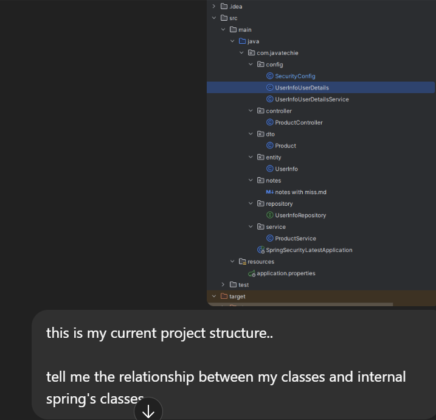

<details><summary>

## JWT 
</summary>

- this project just covers the basic yet vry fundamental stuff
- how we use password based authentication
- just create db with name jwt 
- add users using endpoint and u good to go.
<details><summary>

basic run down of what each class does here..
answered by miss gpt go - 
**prompt**

    explain this and comment on the modern industry prod grade ways of implementing the same.

GOOD follow ups

        tell me what's the better way to name the methods with the job they doing.. for eg u told
        UserInfoUserDetailsService-This bean tells Spring how to load a user from your data source (DB most likely).
</summary>

Short answer to your first doubt:

> **Is this `AuthenticationProvider` bean itself responsible for user authentication with basic password-based login *and* checking the role?**

* ✅ **Yes** for: validating username + password, loading roles/authorities.
* ❌ **No** for: deciding “is this user allowed to call `/products/all`?” → that’s done later by Spring’s **authorization** layer (your `@PreAuthorize` and `authorizeHttpRequests`).

Let’s walk through your code in flow order and then talk about how this differs from modern, prod-grade setups.

---

## 1. What each piece is doing

### 1.1 `UserDetailsService userDetailsService()`

```java
@Bean
public UserDetailsService userDetailsService() {
    return new UserInfoUserDetailsService();
}
```

* This bean tells Spring *how to load a user* from your data source (DB most likely).
* `UserInfoUserDetailsService` will:

    * Take the username
    * Fetch a `UserInfo` entity from DB
    * Wrap it in `UserInfoUserDetails` (your custom `UserDetails`).

So: **“Given a username, how do I get password + roles?”** → `UserDetailsService`.

---

### 1.2 `UserInfoUserDetails` (custom `UserDetails`)

```java
public class UserInfoUserDetails implements UserDetails {

    private String name;
    private String password;
    private List<GrantedAuthority> authorities;

    public UserInfoUserDetails(UserInfo userInfo) {
        name = userInfo.getName();
        password = userInfo.getPassword();
        authorities = Arrays.stream(userInfo.getRoles().split(","))
                .map(SimpleGrantedAuthority::new)
                .collect(Collectors.toList());
    }

    @Override
    public Collection<? extends GrantedAuthority> getAuthorities() {
        return authorities;
    }
    ...
}
```

* It adapts your DB entity (`UserInfo`) to what Spring Security understands (`UserDetails`).

* `authorities` is a list of `SimpleGrantedAuthority` built from `userInfo.getRoles()`.

  So if DB has:
  `roles = "ROLE_ADMIN,ROLE_USER"`
  → it becomes `[ "ROLE_ADMIN", "ROLE_USER" ]` as authorities.

* These **authorities** are what `@PreAuthorize` and `hasAuthority(..)` uses later.

So: **“What are this user’s password and permissions?”** → `UserDetails`.

---

### 1.3 `PasswordEncoder passwordEncoder()`

```java
@Bean
public PasswordEncoder passwordEncoder() {
    return new BCryptPasswordEncoder();
}
```

* This defines how passwords are encoded / matched.
* In DB, your password should already be **BCrypt-hashed**.
* When user sends a raw password, Spring:

    * Reads hashed password from DB
    * Uses this encoder to verify: `matches(raw, encoded)`.

So: **“How do I safely check passwords?”** → `PasswordEncoder`.

---

### 1.4 `AuthenticationProvider authenticationProvider()`

```java
@Bean
public AuthenticationProvider authenticationProvider(){
    DaoAuthenticationProvider authenticationProvider = new DaoAuthenticationProvider();
    authenticationProvider.setUserDetailsService(userDetailsService());
    authenticationProvider.setPasswordEncoder(passwordEncoder());
    return authenticationProvider;
}
```

This is your main login engine.

* **`DaoAuthenticationProvider`** does:

    1. Receives an `Authentication` (username + password) from Spring.
    2. Calls `userDetailsService.loadUserByUsername(...)`.
    3. Gets back a `UserDetails` (with hashed password + authorities).
    4. Uses `passwordEncoder.matches(raw, encoded)` to validate password.
    5. If OK, it returns an **authenticated `Authentication`** object with:

        * Principal = `UserDetails`
        * Authorities = `[ROLE_ADMIN, ROLE_USER, ...]`

> So yes:
>
> * It **authenticates** username/password.
> * It **loads authorities/roles** into the `Authentication` object.
> * But it does **not** itself decide which endpoint you can call – that’s authorization.

Think of it as:

> “I’ll confirm your identity and list what you’re allowed to do.
> I won’t decide whether this specific request is allowed; that’s someone else’s job.”

---

### 1.5 `SecurityFilterChain` – HTTP security rules

```java
@Bean
public SecurityFilterChain securityFilterChain(HttpSecurity http) throws Exception {
    return http.csrf(AbstractHttpConfigurer::disable)
            .authorizeHttpRequests(auth ->
                    auth.requestMatchers("/products/welcome","/products/new").permitAll()
                        .requestMatchers("/products/**").authenticated()
            )
            .httpBasic(Customizer.withDefaults())
            .build();
}
```

* `csrf(..disable)`: CSRF disabled – usually OK for pure APIs (no browser forms) but not for web-app login forms.
* `authorizeHttpRequests`:

    * `/products/welcome`, `/products/new` → **no login required**.
    * Any `/products/**` else → **must be authenticated** (any logged-in user).
* `.httpBasic()`:

    * Uses **HTTP Basic Auth** → username/password sent with each request in an `Authorization` header (Base64 encoded).

Flow for `/products/all`:

1. Request hits filter chain.
2. Basic Auth filter extracts username/password.
3. Sends an `Authentication` object to the `AuthenticationManager`.
4. `AuthenticationManager` delegates to `DaoAuthenticationProvider`.
5. Provider validates credentials, loads authorities.
6. If success → `SecurityContext` now holds authenticated user.
7. Controller is called → then `@PreAuthorize` is evaluated.

---

### 1.6 `@PreAuthorize` in `ProductController`

```java
@GetMapping("/all")
@PreAuthorize("hasAuthority('ROLE_ADMIN')")
public List<Product> getAllTheProducts() { ... }

@GetMapping("/{id}")
@PreAuthorize("hasAuthority('ROLE_USER')")
public Product getProductById(@PathVariable int id) { ... }
```

* Method-level **authorization**, not authentication.
* At this point, the user is already authenticated and has a set of authorities:

    * e.g. `[ "ROLE_ADMIN", "ROLE_USER" ]`
* For `/all`:

    * SpEL `hasAuthority('ROLE_ADMIN')` checks if `"ROLE_ADMIN"` is present in the `Authentication`’s authorities.
* For `/{id}`:

    * Requires `"ROLE_USER"` authority.

So:

* **Authentication** = “Who are you? Prove it (password).” → done by `AuthenticationProvider`.
* **Authorization** = “You are X with roles [..]. Can you access this method?” → done by `@PreAuthorize` / `authorizeHttpRequests`.

---

## 2. How this compares to modern, production-grade setups

Your setup is basically a **simple, DB-backed Basic Auth API with role-based method security**. For learning and internal tools, it’s fine. In production, teams usually evolve this in a few ways:

---

### 2.1 HTTP Basic vs JWT/OAuth2

* **Basic Auth (what you use now)**:

    * Username + password sent on every request.
    * Needs HTTPS always (otherwise credentials are exposed).
    * No concept of “session” or token expiration (beyond credentials themselves).
    * Harder to invalidate single sessions, revoke, add extra metadata.

* **Token-based (JWT/Bearer) – common in prod APIs**:

    * User logs in once → gets a JWT (or opaque token).
    * Subsequent requests send the token, not username/password.
    * Token contains roles/authorities in its claims (`roles`, `scope`).
    * Easier to integrate with mobile apps, SPAs, gateways, and external identity providers (Keycloak, Okta, Cognito, etc).

**Industry style** (for REST APIs):

* Stateless `SessionCreationPolicy.STATELESS`.
* `.oauth2ResourceServer().jwt()` or custom JWT filter instead of `.httpBasic()`.
* Authentication delegated to Identity Provider; your service mostly does **authorization**.

---

### 2.2 Roles & authorities

You’re using `hasAuthority('ROLE_ADMIN')` and storing roles as `"ROLE_ADMIN"` etc. In many codebases you’ll see:

* Store roles without prefix: `"ADMIN"`, `"USER"`.
* Use `hasRole("ADMIN")` instead of `hasAuthority("ROLE_ADMIN")`.

Spring then auto-prefixes with `"ROLE_"` under the hood.

Not mandatory, but more idiomatic:

```java
@PreAuthorize("hasRole('ADMIN')")
public List<Product> getAllTheProducts() { ... }
```

---

### 2.3 UserDetailsService & AuthenticationProvider wiring

You’re manually doing:

```java
@Bean
public UserDetailsService userDetailsService() {
    return new UserInfoUserDetailsService();
}

@Bean
public AuthenticationProvider authenticationProvider() {
    DaoAuthenticationProvider authenticationProvider = new DaoAuthenticationProvider();
    authenticationProvider.setUserDetailsService(userDetailsService());
    authenticationProvider.setPasswordEncoder(passwordEncoder());
    return authenticationProvider;
}
```

In a prod project, we’d more often see:

* `UserInfoUserDetailsService` annotated with `@Service`, auto-wired by Spring.
* `AuthenticationProvider` still as a bean, but injected via constructor rather than calling methods directly:

```java
@Service
public class UserInfoUserDetailsService implements UserDetailsService {
    private final UserInfoRepository repo;

    public UserInfoUserDetailsService(UserInfoRepository repo) {
        this.repo = repo;
    }

    @Override
    public UserDetails loadUserByUsername(String username) {
        // fetch from DB, wrap in UserInfoUserDetails
    }
}
```

```java
@Configuration
public class SecurityConfig {

    private final UserDetailsService userDetailsService;
    private final PasswordEncoder passwordEncoder;

    public SecurityConfig(UserDetailsService userDetailsService,
                          PasswordEncoder passwordEncoder) {
        this.userDetailsService = userDetailsService;
        this.passwordEncoder = passwordEncoder;
    }

    @Bean
    public AuthenticationProvider authenticationProvider() {
        DaoAuthenticationProvider provider = new DaoAuthenticationProvider();
        provider.setUserDetailsService(userDetailsService);
        provider.setPasswordEncoder(passwordEncoder);
        return provider;
    }
}
```

Cleaner, more testable, aligns with prod standards.

---

### 2.4 CSRF, CORS, and session management

For **API-only** backends in production:

* Disable sessions (stateless):

  ```java
  http.sessionManagement(session -> 
       session.sessionCreationPolicy(SessionCreationPolicy.STATELESS)
  );
  ```

* CSRF is usually disabled for pure token-based APIs (no browser forms).

* **CORS** is configured explicitly to allow only known frontend domains.

---

### 2.5 Centralized exception handling, response format

Prod apps usually add:

* Custom `AuthenticationEntryPoint` for 401 responses with a proper JSON body.
* Custom `AccessDeniedHandler` for 403 errors.
* Consistent error format across the API (problem+json style or a custom format).

This improves DX when front-end/mobile teams consume the API.

---

### 2.6 User entity & DTO separation

You’re directly using `UserInfo` in the controller for `@RequestBody`. In prod:

* You’d often use separate **DTOs** for:

    * Requests (`CreateUserRequest`, `LoginRequest`)
    * Responses (`UserResponse`, etc.)
* The entity (`UserInfo`) stays internal to persistence layer (JPA/Hibernate).

This avoids over-exposing fields like `password`, `id`, internal flags.

---

### 2.7 Auditing, logging, and monitoring

Typical prod-ready setups include:

* Audit logs: who did what, when (`Authentication.getName()` in log context).
* MDC logging to attach user/id to every log line.
* Integration with tools like ELK/EFK, Prometheus, Grafana.

---

## 3. TL;DR tying it back to your question

> **this AuthProvider bean is itself responsible for the user authentication with basic password based and checks for the role right..?**

* It **authenticates**:

    * Validates username/password
    * Loads the roles/authorities into the authenticated `Authentication`.

* It does **not itself “check @PreAuthorize”**:

    * `@PreAuthorize("hasAuthority('ROLE_ADMIN')")` is evaluated later, using the authorities populated by this provider.
    * So it **provides the data** required for role checking; the **authorization framework** actually enforces it.

For learning/demo projects, your setup is **perfectly fine**.
For production, teams usually:

* Move from Basic Auth → JWT / OAuth2.
* Make the API stateless.
* Use `hasRole("ADMIN")` + clean DTOs + better wiring.
* Add CORS, proper error handling, logging, and external IdP integration.

If you want, next step we can refactor this same code into a **JWT-based stateless API** version and I’ll annotate what changed and why.

</details>

<details><summary>

man i was unaware all of this is done under the hood man..
1. .what all spring internal classes we using
2. .yes definitely a map will be so much nice..
3. .it still feels too much you know..
4. like i am thinking what to remember and what not?
like if i am told to implement all this.. obviously i will cry
this was from a tutorial i followed how many more things i need to understand in spring security

`a.Basic authentication and authorisation using spring security
b.JWT based token
c.Aspect based (we use it currently)`
?
</summary>

You’re not alone, man.
Everyone gets hit with this “**Spring Security is doing black magic**” moment.
What you’re feeling is *normal* — and honestly it shows you're thinking like a real engineer now, not just copying tutorials.

Let’s slow it down and make this **crystal clear and manageable**.

---

# ✅ 1. What Spring Security internal classes you actually touched

Here’s the honest truth: **you used more Spring Security machinery than you realized**, but you don’t need to *memorize* any of this.

Still, here’s the list of internal classes that got involved under the hood.

### **Authentication flow (Basic Auth)**

| Step                       | Internal Class                              | What it did                                    |
| -------------------------- | ------------------------------------------- | ---------------------------------------------- |
| Read Authorization header  | `BasicAuthenticationFilter`                 | Extract username/password                      |
| Delegate authentication    | `AuthenticationManager` → `ProviderManager` | Choose provider (your bean)                    |
| Validate user              | `DaoAuthenticationProvider`                 | Call UserDetailsService + check password       |
| Load user details          | `UserDetailsService` (your class)           | Return UserDetails (username, password, roles) |
| Create authenticated token | `UsernamePasswordAuthenticationToken`       | Holds user + authorities                       |
| Store in context           | `SecurityContextHolder`                     | Makes the user authenticated globally          |

You didn’t write any of these — Spring used them automatically.

---

# 📍 2. A clean **diagram** so the whole flow clicks

```
               ┌──────────────────────────────────────────────┐
               │                  Request                      │
               │  GET /products/all                            │
               │  Authorization: Basic QmFzYW50OlB3ZDE=        │
               └──────────────────────────────────────────────┘
                                     │
                                     ▼
                     ┌────────────────────────────────┐
                     │   BasicAuthenticationFilter    │
                     └────────────────────────────────┘
                                     │ extracts credentials
                                     ▼
                     ┌────────────────────────────────┐
                     │     AuthenticationManager      │
                     │        (ProviderManager)        │
                     └────────────────────────────────┘
                                     │ picks provider
                                     ▼
               ┌─────────────────────────────────────────────────┐
               │             DaoAuthenticationProvider           │
               └─────────────────────────────────────────────────┘
                     │ calls                     │
                     ▼                           ▼
       ┌─────────────────────────────┐   ┌─────────────────────────────┐
       │    UserDetailsService       │   │     PasswordEncoder         │
       │ (loadUserByUsername)        │   │    matches(raw, encoded)    │
       └─────────────────────────────┘   └─────────────────────────────┘
                     │                           │
                     └────────────── OK ─────────┘
                                     ▼
                     ┌────────────────────────────────┐
                     │  UsernamePasswordAuthenticationToken  │
                     │        (authenticated = true)         │
                     └────────────────────────────────┘
                                     │
                                     ▼
                     ┌────────────────────────────────┐
                     │     SecurityContextHolder      │
                     │    (store authenticated user)  │
                     └────────────────────────────────┘
                                     │
                                     ▼
                    ┌──────────────────────────────────┐
                    │  Controller + @PreAuthorize      │
                    └──────────────────────────────────┘
```

Keep this diagram — this explains 80% of Spring Security.

---

# ✅ 3. “It feels too much… what should I remember?”

Here’s the truth:
**You don’t need to remember ANY of the internal classes.**

What you ACTUALLY must remember is minimal:

---

## ⭐ **What to remember (the real-world checklist)**

### 🔵 **1. Authentication Provider**

Why? → Handles login.
Know how to configure:

```java
DaoAuthenticationProvider
UserDetailsService
PasswordEncoder
```

That’s it.

---

### 🔵 **2. SecurityFilterChain**

Know what these do:

* permitAll
* authenticated
* httpBasic() / formLogin() / oauth2Login()
* csrf disable/enable

---

### 🔵 **3. Method authorization**

Know these:

* `@PreAuthorize("hasAuthority('ROLE_ADMIN')")`
* `@EnableMethodSecurity`

---

### 🔵 **4. The difference between AuthN vs AuthZ**

**Authentication** = who are you
**Authorization** = what are you allowed to access

This is ALWAYS asked in interviews.

---

Everything else?
**Let Spring Security handle it.**
Don’t memorize internals — memorizing is useless.

You just need to know:

> “If I give Spring a provider, it will call it.
> If I give Spring a UserDetailsService, it will use it.
> If I give rules in SecurityFilterChain, it will enforce them.”

That’s enough to build 90% of apps.

---

# ⭐ 4. “How much more do I need to understand in Spring Security?”

Let’s set a practical roadmap.
You're going into interviews soon — you don’t need everything in the world.

Here’s the **must learn** stack:

---

# 🌱 LEVEL 1 — Basics (you’re already here)

### ✔ Basic Authentication

### ✔ Authorization (`@PreAuthorize`, roles)

### ✔ UserDetailsService

### ✔ PasswordEncoder

### ✔ SecurityFilterChain

You’ve done it.
This is enough for service-based companies.

---

# 🌿 LEVEL 2 — JWT (for real-world APIs)

JWT is important because:

* stateless
* no session
* works with mobile apps, gateways
* industry standard

Learn:

* How JWT is generated
* How JWT is validated in a filter
* How user roles are stored inside the token

You don’t need OAuth2 flows until later.

---

# 🌳 LEVEL 3 — Aspect-based (your company uses this)

This is **cross-cutting authorization**, like:

* “If user is owner of resource, allow access”
* “If user belongs to department, allow X”

Using:

* `@Before` / `@Around`
* custom annotations

This is advanced, but once you know method-level security, it’s easier.

---

# 🌲 LEVEL 4 — OAuth2 (optional for later)

Keycloak, Okta, Cognito, Google login, etc.
Not required right now unless your job needs it.

---

# ❤️ The real truth (so you can breathe)

Spring Security is intentionally **extensible** and **pluggable**.
You are not expected to reinvent authentication.
You are only expected to **configure** it properly.

You do NOT need to:

* write filters manually
* write authentication managers
* write provider managers
* override internal classes

Spring Security’s job is to handle that.

Your job is:

> “Tell SpringSecurity → where users come from and how they are validated.”

That's it.

---

# If you want:

I can create a **3-day learning plan** or a **full roadmap** for Spring Security for interviews.

Or we can build a **JWT version** of your current project and you’ll get 10× clarity.

Just tell me what you want next.

</details>

<details>
<summary>


</summary>

Totally get why this feels like “omg how is all this happening behind one bean?!” 😄
You’ve actually wired just **3–4 custom pieces** into a big Spring Security machine. The rest is framework magic.

Let me answer in 3 parts:

1. **Which Spring internal classes are involved**
2. **Map: how your classes connect to those internals**
3. **What you really need to remember + what to learn next (Basic vs JWT vs AOP)**

---

## 1. Which Spring internal classes you’re actually using

With your current project, these are the main Spring Security classes in play:

* **`SecurityFilterChain`**
  From: `org.springframework.security.web.SecurityFilterChain`
  Defined in your `SecurityConfig.securityFilterChain(...)`.
  Spring uses this to build the actual servlet filter chain that sits in front of your controllers.

* **`FilterChainProxy`** (you don’t see it, but it’s there)
  The master security filter that holds all the security filters and runs them.

* **`BasicAuthenticationFilter`**
  Because you used `.httpBasic()`, Spring adds this filter.
  It:

  * Reads `Authorization: Basic ...` header
  * Extracts username/password
  * Creates an `Authentication` object
  * Calls the **`AuthenticationManager`**

* **`AuthenticationManager` / `ProviderManager`**
  A central object that knows about one or more `AuthenticationProvider`s.
  In your case, it holds a single provider: `DaoAuthenticationProvider`.

* **`DaoAuthenticationProvider`**
  Class: `org.springframework.security.authentication.dao.DaoAuthenticationProvider`
  This is the “engine” you created with:

  ```java
  @Bean
  public AuthenticationProvider authenticationProvider() {
      DaoAuthenticationProvider authenticationProvider = new DaoAuthenticationProvider();
      authenticationProvider.setUserDetailsService(userDetailsService());
      authenticationProvider.setPasswordEncoder(passwordEncoder());
      return authenticationProvider;
  }
  ```

  It:

  * Calls your `UserDetailsService`
  * Uses your `PasswordEncoder`
  * Returns an authenticated `Authentication` with authorities

* **`UserDetailsService`** (interface)
  You implemented it as **`UserInfoUserDetailsService`**.
  Spring calls `loadUserByUsername()` on *your* class.

* **`UserDetails`** (interface)
  You implemented it as **`UserInfoUserDetails`**.
  This gives Spring:

  * username
  * password (hashed)
  * authorities (`ROLE_ADMIN`, `ROLE_USER`, etc.)

* **`GrantedAuthority` / `SimpleGrantedAuthority`**
  Each role/permission is a `GrantedAuthority`.
  You build them with `new SimpleGrantedAuthority(roleString)`.

* **Method Security internals** (for `@PreAuthorize`)

  * `MethodSecurityInterceptor`
  * `AccessDecisionManager`
  * `PreInvocationAuthorizationAdvice`

  These pick up your `@PreAuthorize("hasAuthority('ROLE_ADMIN')")` and compare it with the authorities in the current `Authentication`.

So yeah, a LOT happens under the hood – but your code only plugs into **4 key extension points**:

> `UserDetailsService`, `UserDetails`, `AuthenticationProvider`, `SecurityFilterChain`
> (plus a `PasswordEncoder`)

---

## 2. Map: relationship between your classes and Spring’s classes

Let’s map your packages to the flow of a request like:
`GET /products/all` with Basic auth header.

### 2.1 Your project structure (simplified)

* `config`

  * `SecurityConfig`
  * `UserInfoUserDetails`
  * `UserInfoUserDetailsService`
* `controller`

  * `ProductController`
* `dto`

  * `Product`
* `entity`

  * `UserInfo`
* `repository`

  * `UserInfoRepository`
* `service`

  * `ProductService`

### 2.2 Request flow + which class talks to which

**Step 0 – HTTP request enters app**

1. **`FilterChainProxy`** (Spring internal)

  * Uses your `SecurityFilterChain` (bean from `SecurityConfig`).

2. **`BasicAuthenticationFilter`** (because of `.httpBasic()`)

  * Extracts `username:password`
  * Creates `UsernamePasswordAuthenticationToken`
  * Calls `AuthenticationManager` (`ProviderManager`).

---

**Step 1 – AuthenticationManager → DaoAuthenticationProvider**

3. **`ProviderManager`** (Spring internal)

  * Has your `AuthenticationProvider` bean in its list: **`DaoAuthenticationProvider`**.

4. **`DaoAuthenticationProvider`** (Spring internal, bean in your config)

  * Uses:

    * `UserDetailsService` → your `UserInfoUserDetailsService`
    * `PasswordEncoder` → your `BCryptPasswordEncoder`

---

**Step 2 – Load user from DB**

5. **`UserInfoUserDetailsService`** (your class)
   Implements `UserDetailsService`.

   Inside `loadUserByUsername(username)` it probably does:

  * calls `UserInfoRepository.findByName(username)`
  * gets a `UserInfo` entity from DB
  * wraps it as `new UserInfoUserDetails(userInfo)`

6. **`UserInfoRepository`** (your interface)

  * Extends Spring Data `JpaRepository` (Spring generates implementation).
  * Talks to the DB to fetch `UserInfo`.

7. **`UserInfo`** (your entity)

  * Represents DB row: `name`, `password`, `roles`, etc.

8. **`UserInfoUserDetails`** (your class)
   Implements `UserDetails`.

   It provides:

  * `getUsername()` → `UserInfo.name`
  * `getPassword()` → `UserInfo.password` (BCrypt hash)
  * `getAuthorities()` → builds `List<GrantedAuthority>` from `UserInfo.roles`.

---

**Step 3 – Password and authorities**

9. Back in **`DaoAuthenticationProvider`**:

  * It has:

    * raw password from the request
    * encoded password from `UserDetails` (`UserInfoUserDetails`)
    * a `PasswordEncoder` (your `BCryptPasswordEncoder` bean)

  * Calls `passwordEncoder.matches(raw, encoded)`.

  * On success:

    * creates an authenticated `UsernamePasswordAuthenticationToken`
    * puts authorities from `UserDetails.getAuthorities()` onto it.
    * stores this in `SecurityContextHolder`.

---

**Step 4 – Controller & @PreAuthorize**

10. **Spring MVC** now routes to `ProductController.getAllTheProducts()`.

11. Before the method runs, `MethodSecurityInterceptor` (Spring internal) checks `@PreAuthorize("hasAuthority('ROLE_ADMIN')")`:

* Reads current `Authentication` from `SecurityContextHolder`.
* Sees authorities like `[ "ROLE_ADMIN", "ROLE_USER" ]`.
* Evaluates SpEL: `hasAuthority('ROLE_ADMIN')`.
* If true → method executes.
* If false → 403 Forbidden.

12. Inside method, you call `ProductService`, which returns `List<Product>` (DTO), and that’s sent as JSON.

---

So the relationship:

* **Your side (replaceable pieces)**:

  * `UserInfo` + `UserInfoRepository` + `UserInfoUserDetails` + `UserInfoUserDetailsService`
  * `SecurityConfig` beans (SecurityFilterChain, AuthenticationProvider, PasswordEncoder)
  * Controllers + Services + DTOs + Entities.

* **Spring side (framework engine)**:

  * Filters (`BasicAuthenticationFilter`, `FilterChainProxy`)
  * Auth manager (`ProviderManager`)
  * Auth provider (`DaoAuthenticationProvider`)
  * Security context (`SecurityContextHolder`)
  * Method security (`MethodSecurityInterceptor`, `AccessDecisionManager`)

You only implement a **very small surface area** and Spring does the plumbing.

---

## 3. “What do I even remember?” + what to learn next

> “If I’m told to implement all this, I’ll cry.”

You’re **not** expected to implement internal classes.
You just need a **mental model** and know the **main extension points**.

### 3.1 Minimum mental model to remember

Just remember this picture in words:

> 1. Request hits **security filters**.
> 2. A filter extracts credentials and calls the **AuthenticationManager**.
> 3. The manager uses your **AuthenticationProvider**.
> 4. Provider uses your **UserDetailsService + PasswordEncoder** to verify user.
> 5. On success, it stores authenticated user with **authorities** in `SecurityContext`.
> 6. Controller runs; `@PreAuthorize` checks required authorities against that.

Names to remember:

* **Concepts** (most important):

  * Authentication vs Authorization
  * UserDetails, UserDetailsService
  * GrantedAuthority / role
  * AuthenticationProvider
  * SecurityFilterChain
  * SecurityContext

* **Classes** (nice-to-have, not rote-memorize):

  * `DaoAuthenticationProvider`
  * `UsernamePasswordAuthenticationToken`
  * `BasicAuthenticationFilter`
  * `BCryptPasswordEncoder`

That’s enough for interviews and day-to-day backend work.

---

### 3.2 What to learn in Spring Security (for now)

You asked:

> a. Basic authentication and authorization
> b. JWT based token
> c. Aspect-based (we use it currently)

I’d prioritize like this for a 3–5 yr Java dev:

1. **Basic auth / form login + method security** ✅

  * You’re already doing this.
  * Make sure you’re clear on:

    * Roles vs authorities
    * `@PreAuthorize`, `@Secured`
    * CSRF basics
    * Stateless vs stateful sessions (very high-level idea).

2. **JWT-based token (very important in modern APIs)** ⭐

  * Understand conceptually:

    * Login endpoint returns JWT
    * Client sends `Authorization: Bearer <token>`
    * Custom filter or `oauth2ResourceServer().jwt()` validates token
    * No session, stateless
  * You **don’t** have to write a full auth server from scratch; just know how to verify JWT and extract roles.

3. **Aspect-based stuff**

  * `@PreAuthorize` itself is powered by Spring AOP under the hood.
  * If your current company uses custom aspects, just know:

    * What is an `@Aspect`
    * `@Before`, `@Around` basics
    * How pointcuts catch methods and can check user roles / log calls, etc.

You **do not** need to memorize every internal filter and class.

---

If you want, next step I can:

* Draw a super-short **ASCII map** of the flow and
* Show a tiny snippet of what `UserInfoUserDetailsService` typically looks like, with comments that literally say “this is where Spring calls me”.

</details>


</details>